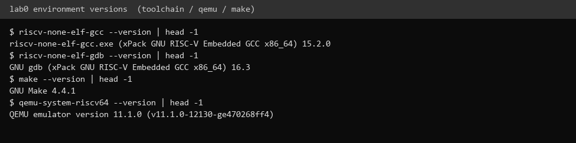
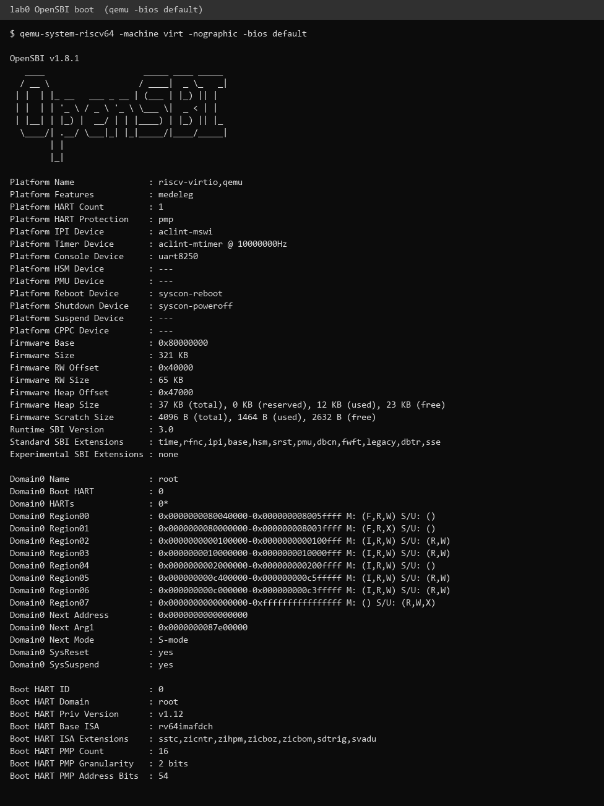

# 操作系统实验报告

## 实验基本信息

| 项目 | 内容 |
|------|------|
| **实验名称** | Lab 0: 预备起（ucore step-by-step 实验环境搭建） |
| **小组成员** | 2410550-杨博、2411210-王禹博、2413124-梁昊 |
| **完成日期** | 2026-10-09 |

---

## 一、实验目的

lab0 是后续所有实验的"预备"。本实验的主要目的是**搭建一个能够编译、运行、调试 riscv64 操作系统内核的实验环境**，为 lab1 及之后各个 lab 提供基础工具：

1. 搭建**交叉编译环境**：在 x86 主机上编译出可以在 riscv64 架构上运行的机器码。
2. 搭建**模拟器环境**：用 QEMU 在 x86 主机上模拟出一台 riscv64 计算机，用来运行和调试内核。
3. 理解并验证 **OpenSBI 固件**作为 bootloader 的作用。
4. 熟悉 Linux 命令行、环境变量等做实验必备的基础操作。
5. 走通"**修改 → 编译 → 运行 → 反馈**"这一基本闭环，为后续 AI 辅助开发做好准备。

---

## 二、实验环境

### AI 编程工具

我这次主要用 **Claude Code**（终端 Agent，也开了 VS Code 扩展）来做实验：搭环境、跑 `make` 和 `qemu` 验证、排查编译和启动问题，以及整理提示词。

### 实验工具版本（实测）

| 组件 | 版本 | 用途 |
|------|------|------|
| 交叉编译器 | `riscv-none-elf-gcc`（xPack GNU RISC-V Embedded GCC）15.2.0 | 交叉编译 riscv64 目标代码 |
| 调试器 | `riscv-none-elf-gdb` 16.3 | 远程调试内核 |
| 构建工具 | GNU Make 4.4.1 | 解析 `Makefile` |
| 模拟器 | QEMU 11.1.0（`qemu-system-riscv64`） | 模拟 riscv64 计算机 |
| 固件 | OpenSBI v1.8.1（QEMU 内置 `-bios default`） | bootloader |

> 说明：指导书以 Ubuntu / WSL 为推荐环境；我是在 **Windows 原生环境**下完成环境搭建的，过程中有两处与文档不同的适配点（见第四节 4.4）。

---

## 三、实验整体逻辑分析

### 3.1 本章节的逻辑主线

本章不涉及操作系统内部功能，而是解决一个"**先决问题**"：**代码在哪里编译、在哪里运行？**

我们日常使用的电脑是 x86 架构，而本课程的操作系统要跑在 riscv64 架构上。于是本章的逻辑主线是：

> **在 x86 主机上，借助"交叉编译器 + 模拟器 + 固件"三件套，搭起一个可以编译并运行 riscv64 内核的实验环境。**

- **编译器**解决"如何把源码变成 riscv64 机器码"——即**交叉编译**；
- **模拟器**解决"riscv64 机器码在哪里跑"——用软件在 x86 上"假装"出一台 riscv64 计算机；
- **固件（OpenSBI）**解决"内核如何被加载并启动"——它扮演 bootloader。

### 3.2 环境搭建的逐步实现

1. **先装交叉编译器** → 因为它是最基础的"生产工具"：没有它，任何源码都无法变成 riscv64 目标码。
2. **再装模拟器 QEMU** → 有了目标码还需要"机器"来跑；QEMU 用软件模拟 CPU、内存、外设（串口等）。
3. **验证固件 OpenSBI** → QEMU 内置 OpenSBI，先用 `-bios default` 单独跑一次固件，确认"目标机器"能用。
4. **最后做环境验证** → 用三件套编译并运行一个最小内核，确认整条链路（编译→链接→加载→运行）打通。

---

## 四、实验内容与实现

### 4.1 交叉编译器

计算机是 x86 架构的，要把程序编译成 riscv64 汇编，需要用"目标语言为 riscv64 机器码的编译器"在 x86 主机上进行**交叉编译**。我们直接使用**预编译（prebuilt）工具链**，免去自行编译工具链的麻烦。

安装完成后，需要把工具链的 `bin` 目录加入 `PATH` 环境变量，才能在任意位置直接调用：

```bash
# ~/.bashrc
export RISCV=/path/to/riscv-toolchain
export PATH=$RISCV/bin:$PATH

# 使配置生效
source ~/.bashrc
```

验证：

```bash
$ riscv-none-elf-gcc --version
riscv-none-elf-gcc.exe (xPack GNU RISC-V Embedded GCC x86_64) 15.2.0
```

**为什么需要环境变量？** 环境变量是操作系统存储系统配置/运行参数的方式，被各进程共享。设置 `PATH` 后，终端输入命令时操作系统会到 `PATH` 列出的路径里查找可执行文件，无需每次输入完整路径；设置 `RISCV` 则便于统一引用工具链安装位置。

### 4.2 模拟器 QEMU 与 OpenSBI

**为什么需要模拟器？** 我们不可能给每人发一块 riscv64 开发板，更高效的方式是用**模拟器**在 x86 上模拟一台 riscv64 计算机：

- **CPU 模拟**：解析 riscv64 指令，在 x86 CPU 上执行；
- **内存模拟**：在宿主机内存中划出一块区域作为"riscv64 物理内存"；
- **外设模拟**：模拟串口（输出映射到终端）、磁盘（对应宿主机镜像文件）、时钟（用宿主机计时器实现）。

安装 QEMU（版本需在 4.1.0 以上），并验证 OpenSBI 固件能跑起来：

```bash
$ qemu-system-riscv64 --version
QEMU emulator version 11.1.0

$ qemu-system-riscv64 --machine virt --nographic --bios default
```

运行后可以看到 OpenSBI 的 banner 和平台信息（`Firmware Base: 0x80000000` 等），说明我们已经在 QEMU 模拟的 riscv virt 机器上把 OpenSBI 固件跑起来了。QEMU 可用 `Ctrl+A` 再按 `x` 退出。

### 4.3 环境验证（编译并运行最小内核）

为了确认"编译 → 运行"整条链路打通，我们编译并运行了 lab1 的**最小可执行内核**：

```bash
# 编译（详见 lab1 报告中的适配说明）
make GCCPREFIX=riscv-none-elf- DEFS="-march=rv64gc -mabi=lp64d"

# 运行
qemu-system-riscv64 -machine virt -nographic -bios default -kernel bin/kernel
```

串口成功打印出 `(THU.CST) os is loading ...`，说明环境搭建成功、整条链路可用，可以进行后续实验。

### 4.4 Windows 原生环境适配（实测差异）

在 Windows 原生环境下复现本实验时，遇到两处与指导书不同的地方，值得记录：

1. **工具链默认目标是 rv32。** 指导书默认工具链前缀为 `riscv64-unknown-elf-`（目标 rv64）；而 xPack 的 `riscv-none-elf-` 工具链**默认目标是 rv32**（`ilp32`），直接 `make` 会在 `libs/printfmt.c` 报 `pointer-to-int-cast`（32 位指针强转为 64 位整型）。解决办法是在编译选项里显式指定 64 位：
   ```bash
   make GCCPREFIX=riscv-none-elf- DEFS="-march=rv64gc -mabi=lp64d"
   ```
2. **`-device loader` 加载方式在新版 QEMU 下不跳转。** 指导书 `Makefile` 的 `qemu` 目标用 `-device loader,file=bin/ucore.img,addr=0x80200000`；但在 QEMU 11.1 + OpenSBI 1.8 下，OpenSBI 的 `Domain0 Next Address` 为 `0x0`，内核不会被执行。改用 `-kernel bin/kernel` 后，QEMU 会自行把内核加载到 `0x80200000` 并据此设置跳转地址，内核正常运行。

这说明"环境搭建"并非机械照抄步骤——不同版本的工具链/模拟器存在差异，需要结合报错理解原理后自行适配。

---

## 五、测试与验证

### 1. 工具链与模拟器版本



### 2. OpenSBI 固件运行（`qemu-system-riscv64 -bios default`）

OpenSBI 成功启动并打印平台信息，`Firmware Base = 0x80000000`，说明模拟器与固件均正常工作：



### 3. 环境验证结果

编译并运行最小内核后，串口输出 `(THU.CST) os is loading ...`（详见 lab1 报告"测试与验证"章节），证明"编译 → 加载 → 运行"闭环打通，环境搭建完成。

---

## 六、实验总结与收获

### 对操作系统的理解

1. **本章重要知识点及与 OS 原理的对应**

| 本实验知识点 | 对应的 OS 原理知识点 | 含义、关系与差异 |
|--------------|---------------------|------------------|
| 交叉编译（cross compile） | 编译器 / 目标代码生成 | 原理课讲"源码如何变成机器码"；本实验强调**宿主机架构 ≠ 目标架构**时必须交叉编译，是内核开发的先决条件。 |
| 模拟器（emulator） | 虚拟机 / 硬件抽象 | 原理课讲虚拟化、硬件抽象层；QEMU 用软件"假装"出 CPU、内存、外设，是理解"硬件接口"的直观教具。 |
| 固件 OpenSBI 作为 bootloader | 引导加载 / 特权级 | 原理课讲"固件→引导程序→内核"三级跳；本实验对应 RISC-V 的 M 态固件，引出 M/S/U 特权级概念。 |
| 环境变量 `PATH` / `RISCV` | 进程环境 / 系统配置 | 原理课讲进程运行环境；本实验用它让工具链随处可用，是"系统配置影响进程行为"的小例子。 |

2. **OS 原理中很重要、但本实验没有对应上的知识点**

- 本实验**不涉及任何操作系统内部机制**：没有进程/线程、没有内存管理、没有中断、没有文件系统。它只是"工具准备"，是后续 lab 的**前置条件**而非 OS 功能本身。

### AI 协作开发的经验

1. **环境问题是"人机协作"的第一道考验。** 日志里大量版本与网络信息（工具链默认架构、QEMU 加载方式）需要先理解原理再判断，AI 能加速排查，但"哪条报错对应哪个根因"仍需我们自己判断。
2. **先跑通最小闭环，再谈其余。** 我们坚持先让"最小内核"跑起来（看到 `os is loading`），确认整条链路可用，而不是一上来就堆砌工具——这符合 step-by-step 的学习思路。
3. **把环境差异记录下来。** 本次遇到的 rv32 默认目标、`-device loader` 不跳转两个坑，都记录在报告里；这类"文档没写、真实存在"的差异，是经验积累中最有价值的部分。

---
