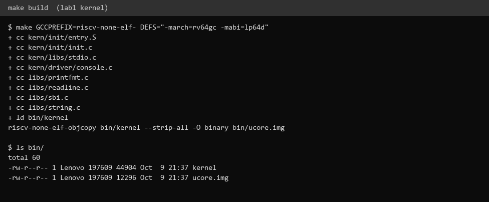
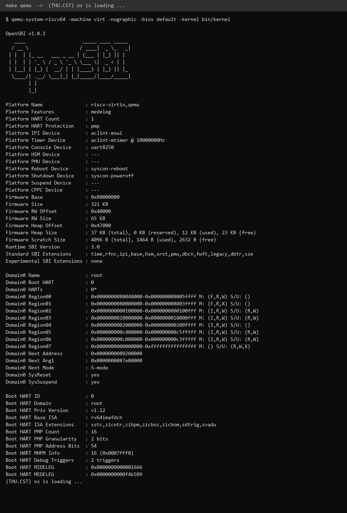
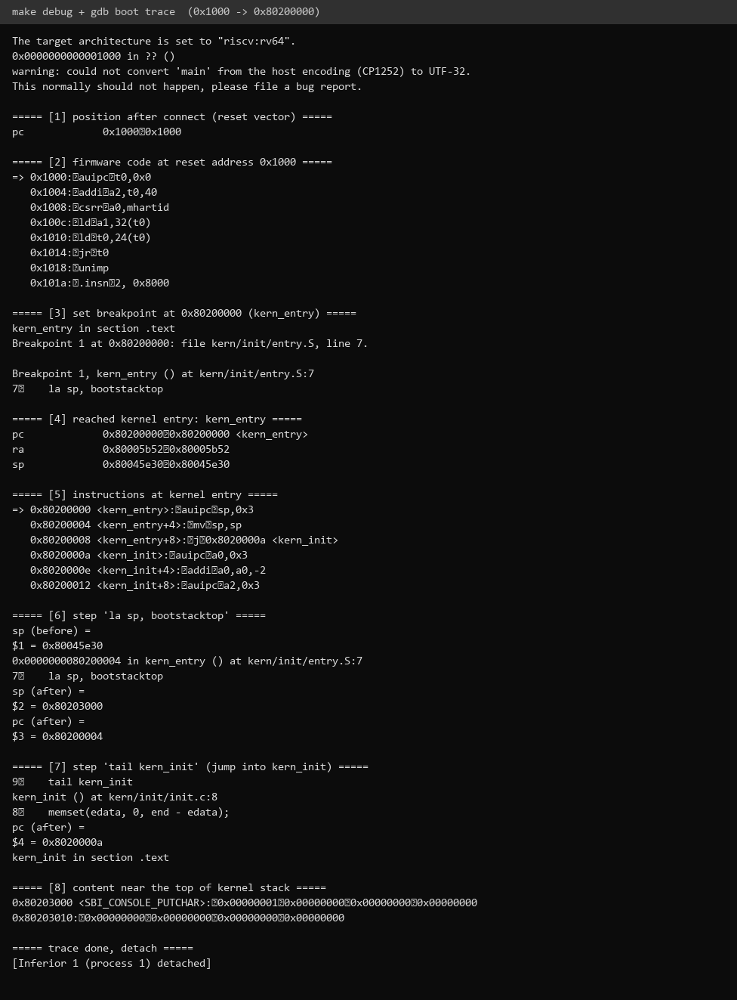

# 操作系统实验报告

## 实验基本信息

| 项目 | 内容 |
|------|------|
| **实验名称** | Lab 1: 最小可执行内核（比麻雀更小的麻雀） |
| **小组成员** | 2410550-杨博、2411210-王禹博、2413124-梁昊 |
| **完成日期** | 2026-10-09 |

---

## 一、实验目的

本实验的主要目的是：构建一个能够在 QEMU 模拟的 64 位 RISC-V 计算机上运行的最小可执行内核，并完整理解"从机器加电到操作系统开始运行"的过程。

1. 理解内核的内存布局和入口点设置：学会使用**链接脚本**描述程序各段（`.text/.rodata/.data/.bss`）的放置位置，并指定内核入口。
2. 掌握**交叉编译**流程：在 x86 主机上把 C / 汇编源码编译、链接为 riscv64 目标代码，再生成内核镜像。
3. 理解 **OpenSBI（bootloader）** 的作用：由它完成固件初始化、把内核加载到 `0x80200000` 并把控制权交给内核。
4. 学会使用 OpenSBI 提供的服务（SBI 调用），在屏幕上格式化打印字符串，为后续实验的调试打好基础。

---

## 二、实验环境

### AI 编程工具

我这次主要用 **Claude Code**（终端 Agent，也开了 VS Code 扩展）来做实验：环境搭建、`make` 和 `qemu` 的编译运行验证、GDB 启动流程调试，以及提示词的整理。

### 交叉编译与模拟环境

本实验原本以 Ubuntu / WSL 作为标准环境。我们进一步尝试在 **Windows 原生环境**下完成，工具链与模拟器版本如下（均为 2026-10 实测）：

| 组件 | 版本 | 说明 |
|------|------|------|
| 交叉编译器 | `riscv-none-elf-gcc` (xPack GNU RISC-V Embedded GCC) 15.2.0 | riscv64 交叉编译 |
| 调试器 | `riscv-none-elf-gdb` 16.3 | 远程调试 QEMU |
| 构建工具 | GNU Make 4.4.1 | 解析 `Makefile` + `tools/function.mk` |
| 模拟器 | QEMU 11.1.0 (`qemu-system-riscv64`) | `-machine virt` |
| 固件 | OpenSBI v1.8.1（QEMU 内置 `-bios default`） | bootloader |

> **环境适配说明（实测中的重要差异）**
> 1. 实验室文档默认使用 `riscv64-unknown-elf-` 前缀的工具链（默认目标为 rv64）。xPack 的 `riscv-none-elf-` 工具链**默认目标是 rv32**（`ilp32`），直接编译会在 `printfmt.c` 报 `pointer-to-int-cast` 错误。因此在 `make` 时通过 `DEFS` 追加 `-march=rv64gc -mabi=lp64d`，并对前缀做覆盖：
>    ```bash
>    make GCCPREFIX=riscv-none-elf- DEFS="-march=rv64gc -mabi=lp64d"
>    ```
> 2. 文档用 `-device loader,file=bin/ucore.img,addr=0x80200000` 加载内核。但在 QEMU 11.1 + OpenSBI 1.8 下，该方式下 OpenSBI 打印的 `Domain0 Next Address` 为 `0x0`，内核**不会被执行**。改用 `-kernel bin/kernel`（QEMU 会把内核加载到 `0x80200000` 并据此设置跳转地址），内核即可正常运行。

---

## 三、实验整体逻辑分析

### 3.1 本章节的逻辑主线

本章围绕一个核心问题展开：**操作系统内核是如何被加载并开始运行的？**

现代计算机不能"自己把自己从硬盘加载到内存"——在操作系统运行之前，必须有一个更底层的程序充当"先锋队"：它先初始化硬件，再把操作系统内核搬进内存，最后把 CPU 控制权交给操作系统。这个程序叫 **bootloader**。在 QEMU 的 RISC-V virt 机器上，这个 bootloader 就是 **OpenSBI** 固件。

因此 lab1 的主线是：**先搭好"内存布局 + 入口点"，再打通"输出"，最后用 `make` 把整条链路串起来跑通。**

### 3.2 功能的逐步实现

1. **先确定内存布局与入口点**（`tools/kernel.ld` + `kern/init/entry.S`）
   为什么最先做这个？因为内核代码是**地址相关**的：链接器在链接时就把 `sum` 这类符号的绝对地址写进了指令编码。内核约定被加载到 `0x80200000`，所以必须用链接脚本固定各段位置，并让 `entry.S` 的 `kern_entry` 成为镜像第一条指令。OpenSBI 才能正确地"跳到 `0x80200000` 并开始执行"。

2. **再打通从 SBI 到 stdio 的输出链路**（`libs/sbi.c` → `kern/driver/console.c` → `kern/libs/stdio.c` → `libs/printfmt.c`）
   为什么接着做？内核在成型之前无法依赖任何现成运行库（否则就是"用操作系统开发操作系统"的鸡生蛋问题）。所以从最原始的"输出一个字符"接口出发，像搭积木一样层层封装，最终得到 `cprintf`，这样才能观察内核是否真的跑起来了。

3. **最后用 Makefile 把编译、链接、生成镜像、启动 QEMU 串成一条命令**（`Makefile` + `tools/function.mk`）
   为什么最后做？有了源码和链接脚本，还需要"编译全部源码 → 链接成 ELF → `objcopy` 生成 bin 镜像 → QEMU 加载运行"这一串操作。Makefile 让这一串操作变成 `make qemu` 一条命令，使"改代码 → 编译 → 观察结果"的迭代闭环得以建立。

顺序可以概括为：**定布局（在哪里跑）→ 通输出（跑起来看得见）→ 一键构建（能反复跑）。**

### 3.3 完整启动流程

```
加电复位 → CPU 从 0x1000 (MROM) 开始
        → 跳转到 0x80000000 (OpenSBI)
        → OpenSBI 初始化并把内核加载到 0x80200000
        → 跳转到 0x80200000，执行 entry.S 的 kern_entry
        → la sp, bootstacktop（建立内核栈）→ tail kern_init
        → kern_init() 清零 .bss、调用 cprintf 输出
        → while(1) 死循环
```

---

## 四、实验内容与实现

### 练习 1：理解内核启动中的程序入口操作

**相关源码 `kern/init/entry.S`：**

```asm
#include <mmu.h>
#include <memlayout.h>

    .section .text,"ax",%progbits
    .globl kern_entry
kern_entry:
    la sp, bootstacktop
    tail kern_init

.section .data
    .align PGSHIFT
    .global bootstack
bootstack:
    .space KSTACKSIZE
    .global bootstacktop
bootstacktop:
```

#### `la sp, bootstacktop` 完成了什么操作，目的是什么？

- **操作**：`la`（load address）是一个伪指令，把符号 `bootstacktop` 的**地址**装入寄存器 `sp`。该符号定义在 `.data` 段、紧随 `bootstack`（`.space KSTACKSIZE`，即 `2 × PGSIZE = 2 × 4096 = 8192` 字节）之后，因此 `bootstacktop = &bootstack + KSTACKSIZE`，指向内核栈区域的**最高地址（栈顶）**。执行后 `sp ← bootstacktop`。
- **目的**：在跳入 C 语言函数 `kern_init` 之前，**为 C 代码准备一个合法的内核栈**。C 函数调用需要使用栈保存返回地址（`ra`）、局部变量和被调用者保存寄存器；RISC-V 的栈是**向下增长**的，所以最初"空栈"的栈指针应指向栈区域的最高处（`bootstacktop`），后续入栈时 `sp` 再向下移动。
  - 如果不设置：`sp` 仍是 OpenSBI 遗留的值（实测为 `0x80045e30`，属于 OpenSBI 的栈），内核函数的入栈/出栈会破坏固件的内存，导致崩溃。

> 实测反汇编印证（`obj/kernel.asm`）：
> ```asm
> 80200000 <kern_entry>:
>     la sp, bootstacktop
>     80200000:  auipc sp,0x3        # sp = pc + 0x3000 = 0x80203000
>     80200004:  mv    sp,sp         # addi sp,sp,0（低 12 位为 0，被优化掉）
> ```

#### `tail kern_init` 完成了什么操作，目的是什么？

- **操作**：`tail` 是 RISC-V 的伪指令，展开为 `auipc x6, offset_hi; jalr x0, x6, offset_lo`（若目标在跳转范围内，汇编器会优化成一条 `j`，即 `jal x0, offset`）。它的语义是**跳转到 `kern_init` 并丢弃返回地址**（把返回地址写进 `x0`/零寄存器，等于不保存）。
- **目的**：把控制权交给真正的 C 入口 `kern_init`。由于 `kern_entry` 只做了"建立内核栈"这一件事，且 `kern_init` 被声明为 `noreturn`（内含 `while(1)`），永远不会返回，所以没有"返回"的需求。
  - 用 `tail`（尾调用）而不是 `call`（`jal ra, ...`），可以**避免在栈上压入一个永远不会用到的返回地址**，同时也精确表达了"这是最后一步，不会再回来"的语义。

> 实测反汇编：`tail kern_init` 被优化为 `80200008: j 8020000a <kern_init>`（`j` 即 `jal x0, ...`，不写 `ra`）。

总的来说，`entry.S` 这两条指令就是"从汇编世界进入 C 世界"的桥梁——先备好栈（`la sp`），再无返回地跳进 C 内核（`tail`）。

---

### 练习 2：使用 GDB 验证启动流程

#### 调试方法

QEMU 可以扮演"被调试目标"：`-S` 让虚拟 CPU 一启动就暂停，`-s` 打开 `1234` 端口等待 GDB 连接。另一个终端里用 `riscv-none-elf-gdb` 远程连接：

```bash
# 终端 1：启动 QEMU 并暂停，等待调试
qemu-system-riscv64 -machine virt -nographic -bios default -kernel bin/kernel -s -S

# 终端 2：连接并加载符号
riscv-none-elf-gdb -q \
    -ex 'file bin/kernel' \
    -ex 'set architecture riscv:rv64' \
    -ex 'target remote localhost:1234'
```

#### 调试过程与观察结果

**(1) 连接后 CPU 停在复位地址 `0x1000`**

```
===== [1] position after connect (reset vector) =====
pc             0x1000

===== [2] firmware code at reset address 0x1000 =====
=> 0x1000:  auipc  t0,0x0
   0x1004:  addi   a2,t0,40
   0x1008:  csrr   a0,mhartid
   0x100c:  ld     a1,32(t0)
   0x1010:  ld     t0,24(t0)
   0x1014:  jr     t0
```

**(2) 在 `0x80200000`（`kern_entry`，内核第一条指令）下断点并继续**

```
===== [3] set breakpoint at 0x80200000 (kern_entry) =====
kern_entry in section .text
Breakpoint 1 at 0x80200000: file kern/init/entry.S, line 7.
Breakpoint 1, kern_entry () at kern/init/entry.S:7
7       la sp, bootstacktop

===== [4] reached kernel entry: kern_entry =====
pc   0x80200000  <kern_entry>
ra   0x80005b52            # OpenSBI 的返回地址
sp   0x80045e30            # 仍是 OpenSBI 的栈
```

**(3) 单步执行两条入口指令**

```
===== [6] step 'la sp, bootstacktop' =====
sp (before) = 0x80045e30   # OpenSBI 栈
sp (after)  = 0x80203000   # = bootstacktop，内核栈栈顶

===== [7] step 'tail kern_init' =====
pc (after) = 0x8020000a    # kern_init in section .text
```

#### 问题回答

**Q1：RISC-V 硬件加电后最初执行的几条指令位于什么地址？**

位于 **`0x1000`**（复位向量 / reset vector）。这是处理器上电时 `PC` 被硬件强制设置的值，从这里开始执行的是一小段写死的固件代码（MROM）。

**Q2：这几条指令主要完成了哪些功能？**

`0x1000` 处的 6 条指令是一段"跳板"，作用是**按 RISC-V 启动约定准备好寄存器，然后跳到下一级固件（OpenSBI）**：

| 指令 | 作用 |
|------|------|
| `auipc t0, 0x0` | `t0 ← PC`，即 `0x1000`（取得自身的基址，用于后续按偏移取值） |
| `addi a2, t0, 40` | `a2 ← 0x1028`，指向设备树（DTB）等信息（RISC-V 启动约定：`a2` 传 DTB 相关地址） |
| `csrr a0, mhartid` | `a0 ← hart id`（当前硬件线程号，约定在 `a0` 传递） |
| `ld a1, 32(t0)` | `a1 ← mem[0x1020]` = 固件基址 `0x80000000` |
| `ld t0, 24(t0)` | `t0 ← mem[0x1018]` = 固件（OpenSBI）入口地址 |
| `jr t0` | 跳转到 OpenSBI，**控制权移交固件** |

即：把 `hartid`、DTB 指针、固件基址分别放进约定的寄存器，然后 `jr` 跳到 `0x80000000` 处的 OpenSBI。

**Q3：控制权如何最终交给内核？**

OpenSBI 在 M 态完成硬件初始化后，把内核镜像加载到物理地址 `0x80200000`（本实验由 QEMU 预加载），随后跳转到 `0x80200000`。我们在 `0x80200000` 下的断点正好命中——此时 `pc = 0x80200000 <kern_entry>`，证明控制权已经交给内核，内核从 `kern_entry` 的第一条指令 `la sp, bootstacktop` 开始执行。

> **关键数据**：内核栈 `bootstack` = `0x80201000`，`bootstacktop` = `0x80203000`（由 `obj/kernel.sym` 验证）。因此单步执行 `la sp, bootstacktop` 后 `sp` 从 OpenSBI 的 `0x80045e30` 变为 `0x80203000`，与符号表完全吻合。

---

### 附：本实验向 AI 提出的提示词

lab1 的两个练习都是分析题，没有需要填写的代码，所以我主要是让 AI 帮我研读启动链路、解释关键指令，并给出一套可以照做的调试步骤。完整提示词见同目录 [prompt.md](./prompt.md)。

**练习1 用到的提示词（节选）：**

````markdown
[PROMPT]
任务：阅读 kern/init/entry.S，解释 la sp, bootstacktop 与 tail kern_init
两条指令各自完成了什么操作、目的是什么。
输出要求：结合 RISC-V 调用约定与 ucore 内存布局，给出结论并说明依据，
不要只复述指令字面含义。

[RELY]
- 链接脚本 tools/kernel.ld：内核加载基址 BASE_ADDRESS = 0x80200000
- kern/mm/mmu.h: PGSIZE=4096, PGSHIFT=12
- kern/mm/memlayout.h: KSTACKPAGE=2, KSTACKSIZE=KSTACKPAGE*PGSIZE
- entry.S: bootstack 位于 .data 段，.space KSTACKSIZE，其后紧跟 bootstacktop

[GUARANTEE]
产出对以下两点的说明：
1. la sp, bootstacktop 的操作与目的
2. tail kern_init 的操作与目的

[SPECIFICATION]
## la sp, bootstacktop
Pre-Condition：CPU 刚进入 kern_entry，sp 仍为 OpenSBI 遗留值。
Post-Condition：sp 指向内核栈顶 bootstacktop（= &bootstack + KSTACKSIZE）。
Case 1：说明 la 是伪指令（装入符号地址）；说明栈向下增长，故空栈栈顶取最高地址。
Case 2：说明不设置 sp 的后果（沿用固件栈会破坏固件内存）。

## tail kern_init
Pre-Condition：内核栈已就绪。
Post-Condition：控制权交给 kern_init，且不在栈上留下返回地址。
Case 1：说明 tail = 跳转且丢弃返回地址（jalr x0 / j）。
Case 2：说明与 call 的区别、以及与 kern_init 为 noreturn 的对应关系。
````

#### 实现迭代过程

**第一次迭代：** 初次提问时只给了 `entry.S` 片段，AI 的回答停留在"把栈顶地址给 sp / 跳到 kern_init"的字面复述，未说明**为什么**要取栈顶、为什么用 `tail` 而非 `call`。

**第二次迭代：** 在 `[RELY]` 中补全了 `KSTACKSIZE` 的定义、`bootstack`/`bootstacktop` 的相对位置，以及"栈向下增长""C 函数需要栈"的上下文，并在 `[SPECIFICATION]` 中把每个函数拆成 Pre/Post-Condition + Case。AI 的回答随即补上了"空栈栈顶取最高地址""tail 不压返回地址、与 noreturn 对应"等关键原因。

**最终结果：** 结合 `objdump` 反汇编（`auipc sp,0x3; mv sp,sp` 与 `j kern_init`）与 GDB 实测（`sp: 0x80045e30 → 0x80203000`）验证，结论与真实机器行为一致。

**关键改进点总结：**
1. 在 `[RELY]` 中补充了真实的宏定义与符号相对位置（而不是只给源码片段）。
2. 在 `[SPECIFICATION]` 中用 Pre/Post-Condition 明确"执行前/后的状态"，迫使回答落到系统语义而非字面含义。
3. 追加"用反汇编和 GDB 实测验证"的要求，把静态分析与动态行为对齐。

---

## 五、测试与验证

### 1. 编译与链接（`make`）

成功编译全部源文件，链接生成 `bin/kernel`（ELF），并用 `objcopy` 生成 `bin/ucore.img`（去掉符号/调试信息的纯二进制镜像）：



### 2. 运行内核（QEMU）

用 QEMU 加载内核运行，OpenSBI 完成初始化后跳入内核，串口打印出 `(THU.CST) os is loading ...`，随后进入死循环——**最小可执行内核跑通了**：



### 3. GDB 启动流程跟踪（练习2）

从复位地址 `0x1000` 一路跟踪到内核入口 `0x80200000`，验证了：
- 复位后 `PC = 0x1000`；
- `0x1000` 处固件指令把参数装入约定寄存器并跳到 OpenSBI；
- 断点命中 `0x80200000 <kern_entry>`，`la sp, bootstacktop` 使 `sp` 变为 `0x80203000`，`tail kern_init` 使 `pc` 变为 `0x8020000a <kern_init>`。



---

## 六、实验总结与收获

### 对操作系统的理解

**1. 本实验的重要知识点，及其与 OS 原理知识点的对应**

| 本实验知识点 | 对应的 OS 原理知识点 | 含义、关系与差异 |
|--------------|---------------------|------------------|
| 链接脚本 / 内存布局（`.text/.rodata/.data/.bss`） | 进程的地址空间 / 程序的内存映像 | 原理课讲的是"一个进程运行时内存里有哪些区"；本实验落到"内核镜像在物理内存里如何按段摆放"，是把抽象的内存映像具体化到链接阶段。 |
| 入口点 `kern_entry` + `la sp, bootstacktop` | 进程/线程上下文与栈的建立 | 原理课讲"进程需要栈保存调用上下文"；本实验展示**内核的第一条指令就是建立栈**，即"栈是执行 C 代码的前提"。 |
| OpenSBI 作为 bootloader、`0x80200000` 加载地址 | 引导加载（bootstrapping）/ 地址重定位 | 原理课常以"固件→引导程序→内核"三级跳描述启动；本实验用 RISC-V 的 M/S 特权级与固定加载地址把这一过程落到代码。 |
| SBI 调用（`ecall`）封装 | 系统调用 / 特权级切换 | 原理课的"用户态→内核态"系统调用，和本实验的"S 态→M 态" SBI 调用**同构**：都是通过 `ecall` 陷入更高特权级，只是目标特权级不同。 |
| 地址相关性（代码必须被加载到指定地址） | 链接与重定位 | 原理课讲编译链接的一般过程；本实验强调"内核是地址相关代码，故必须加载到约定位置"，引出后续 lab 的虚拟内存/地址无关思考。 |

**2. OS 原理中很重要、但本实验没有对应上的知识点**

- **进程与线程管理与调度**：本实验的内核只是一个"死循环"，没有进程/线程概念，也没有调度器（后续 lab 覆盖）。
- **虚拟内存与分页**：本实验直接使用物理地址（`0x80200000`），没有页表、没有虚拟地址到物理地址的转换。
- **中断与异常处理**：本实验没有开启/处理任何中断（`kern/trap` 相关文件在本阶段尚未发挥作用）。
- **同步互斥、文件系统、系统调用接口**：均未涉及。

### AI 协作开发的经验

1. **给足"最小且可信"的上下文是关键。** 第一次提问只贴 `entry.S`，AI 只能复述字面；把 `KSTACKSIZE`、`bootstack` 的相对位置等真实定义（`[RELY]`）补上后，回答立刻从"是什么"上升到"为什么"。
2. **用规格（Pre/Post-Condition）逼出系统语义。** 要求 AI 明确"执行前/后系统处于什么状态"，能有效避免它写出看似正确、实则含糊的解释。
3. **AI 的结论必须用工具验证。** 本次所有关键结论（`sp` 的具体数值、`tail` 被优化为 `j`）都用 `objdump` 反汇编和 GDB 实测核对过——AI 负责加速理解，**正确性仍由我们负责**。
4. **环境差异要自己判断。** 实验室文档基于旧版 QEMU/OpenSBI，我们在新版环境（QEMU 11.1 / OpenSBI 1.8）中遇到了 rv32 默认目标、`-device loader` 不跳转等问题，需要结合报错自行定位并调整——这类"文档没写、但真实存在"的坑，AI 只能辅助分析，最终判断还得靠人。

---
